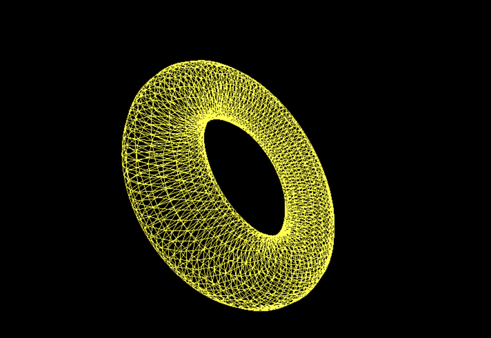
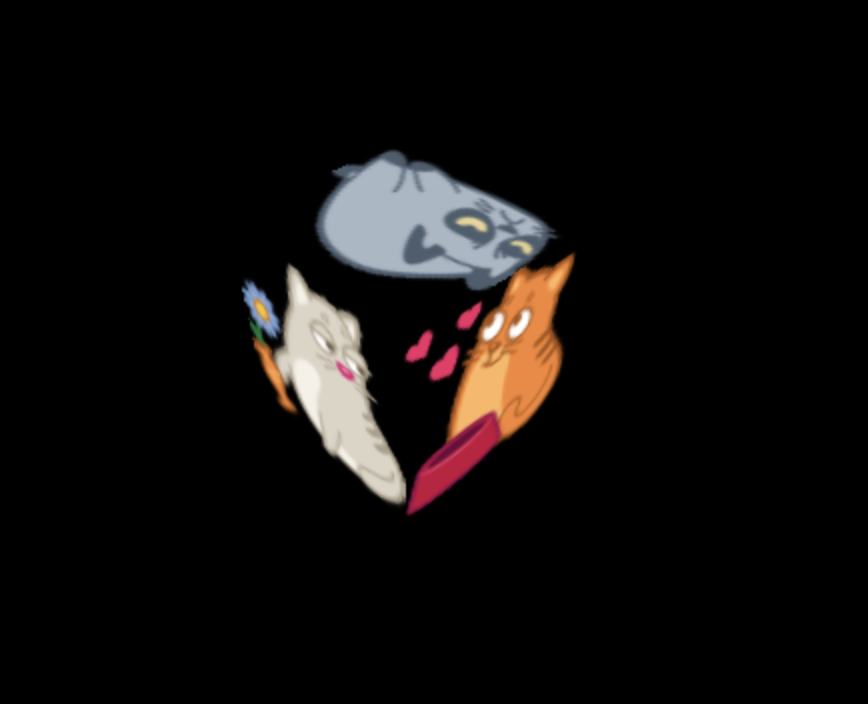

# threeJs-first-project :three:

### TO START

1. download three.js (https://threejs.org/)

- add the `three.js` file in the folder

- on the command line type:
`php -S 127.0.0.1:8080`

- on the browser go to
`http://127.0.0.1:8080`

:tada: :tada: :tada:

### TOPICS

* [Geometry](https://threejs.org/docs/index.html#api/en/geometries/ConeBufferGeometry) :black_square:

* [Controls](https://threejs.org/examples/?q=controls#misc_controls_pointerlock) :arrow_upper_right:
